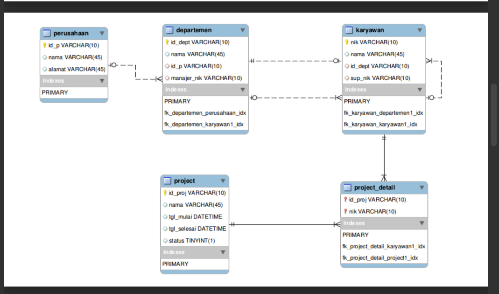
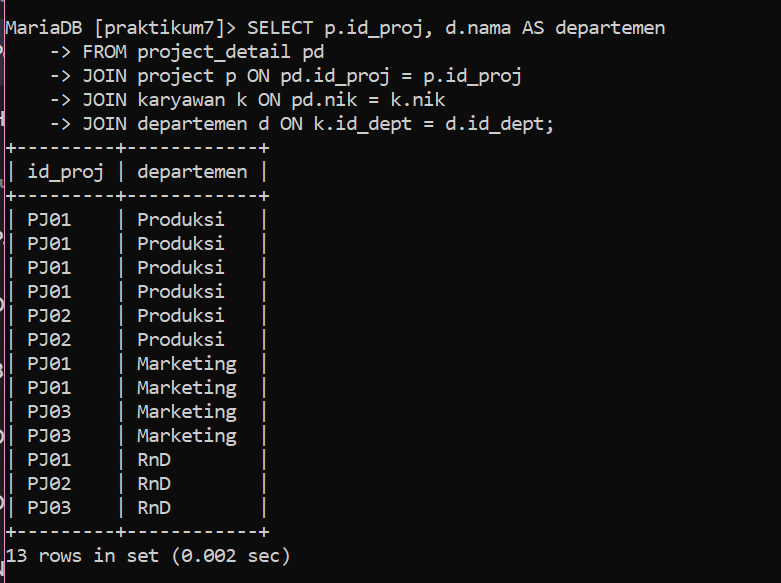
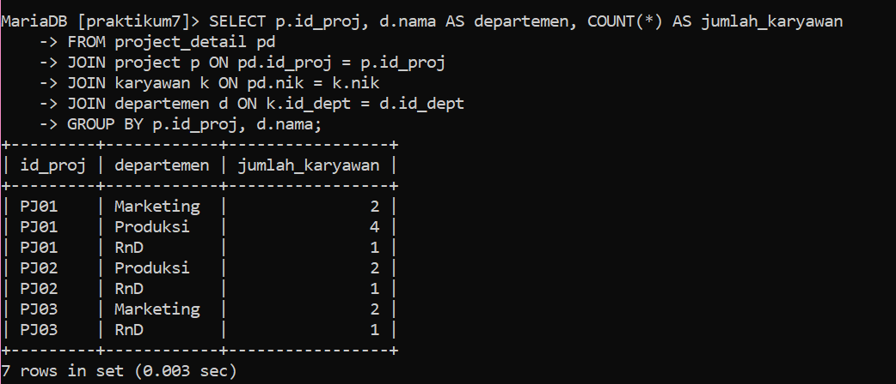
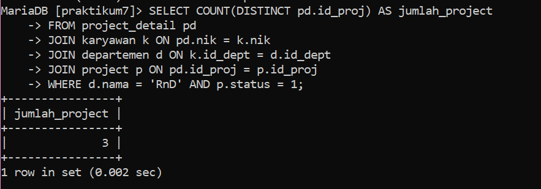
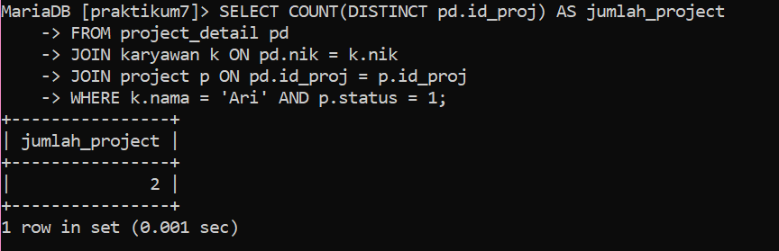
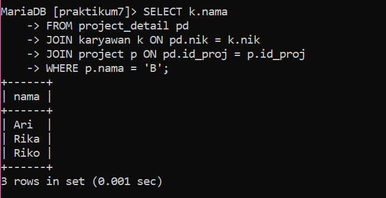

# praktikum7
``` 
Febriyani Nurhida
TI.22.A2
312210222
```

## Relasi Table



## Latihan Praktikum
Buat query untuk menampilkan:
1. Departemen apa saja yang terlibat dalam tiap-tiap project
2. Jumlah karyawan tiap departemen yang bekerja pada tiap-tiap
project
3. Ada berapa project yang sedang dikerjakan oleh departemen RnD?
(ket: project berjalan adalah yang statusnya 1)
4. Berapa banyak project yang sedang dikerjakan oleh Ari?
5. Siapa saja yang mengerjakan projcet B?

Berikut adalah query SQL untuk menjawab pertanyaan-pertanyaan di atas:

1. Departemen apa saja yang terlibat dalam tiap-tiap project:

```sql
SELECT p.id_proj, d.nama AS departemen
FROM project_detail pd
JOIN project p ON pd.id_proj = p.id_proj
JOIN karyawan k ON pd.nik = k.nik
JOIN departemen d ON k.id_dept = d.id_dept;
```




2. Jumlah karyawan tiap departemen yang bekerja pada tiap-tiap project:

```sql
SELECT p.id_proj, d.nama AS departemen, COUNT(*) AS jumlah_karyawan
FROM project_detail pd
JOIN project p ON pd.id_proj = p.id_proj
JOIN karyawan k ON pd.nik = k.nik
JOIN departemen d ON k.id_dept = d.id_dept
GROUP BY p.id_proj, d.nama;
```




3. Ada berapa project yang sedang dikerjakan oleh departemen RnD?

```sql
SELECT COUNT(DISTINCT pd.id_proj) AS jumlah_project
FROM project_detail pd
JOIN karyawan k ON pd.nik = k.nik
JOIN departemen d ON k.id_dept = d.id_dept
WHERE d.nama = 'RnD' AND p.status = 1;
```





4. Berapa banyak project yang sedang dikerjakan oleh Ari?

```sql
SELECT COUNT(DISTINCT pd.id_proj) AS jumlah_project
FROM project_detail pd
JOIN karyawan k ON pd.nik = k.nik
WHERE k.nama = 'Ari' AND p.status = 1;
```





5. Siapa saja yang mengerjakan project B?

```sql
SELECT k.nama
FROM project_detail pd
JOIN karyawan k ON pd.nik = k.nik
JOIN project p ON pd.id_proj = p.id_proj
WHERE p.nama = 'B';
```





Pastikan untuk mengganti "project_detail", "project", "karyawan", dan "departemen" dengan nama tabel yang sesuai jika Anda telah menggunakan nama tabel lain dalam database Anda.

Dengan menggunakan query-query SQL di atas, Anda dapat mendapatkan informasi yang Anda butuhkan sesuai dengan pertanyaan yang diajukan.